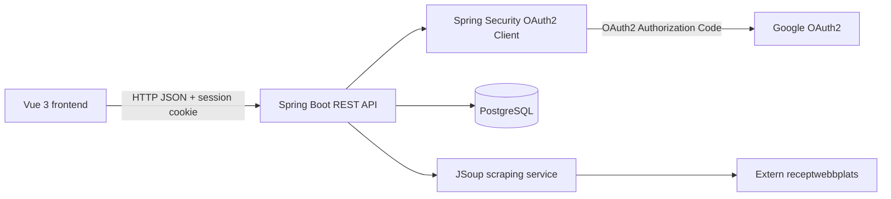
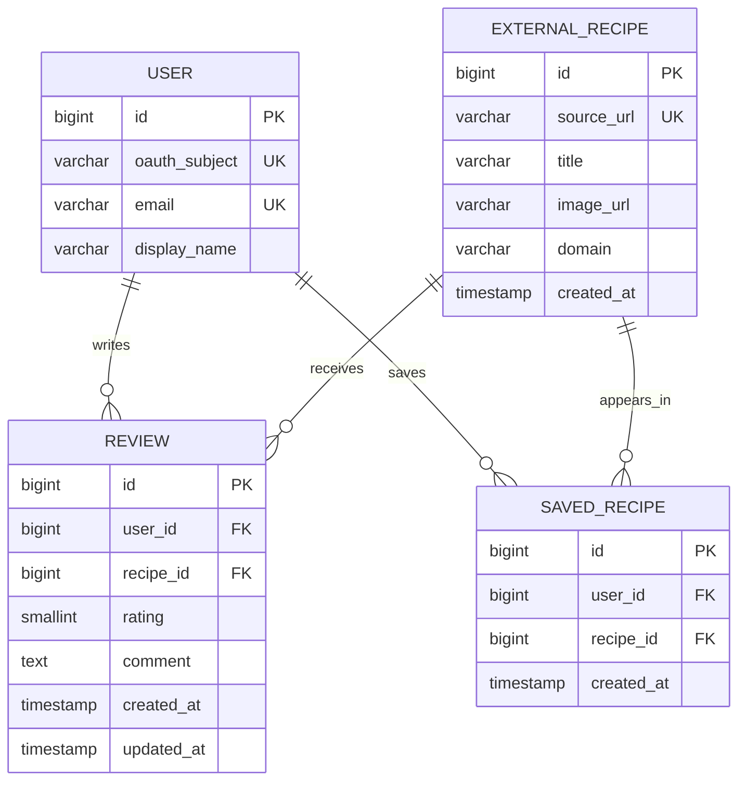
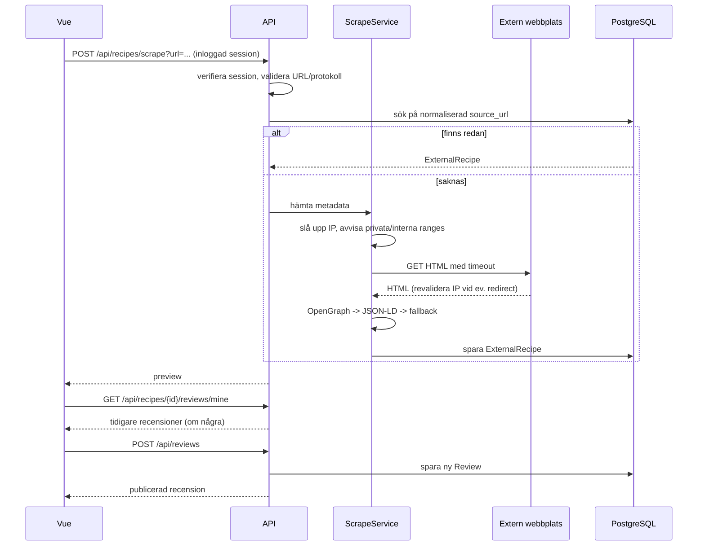

# Arkitektur: receptfeed

## Översikt



Frontendens huvudflöden är `/feed` och `/add-review`. Backendens domäner är användare, externa recept, recensioner och sparade recept. PostgreSQL körs lokalt med Docker och innehåller endast metadata om externa recept. Inloggning sker uteslutande via Google OAuth2 — ingen lösenordshantering finns i backend.

## Domänmodell



### Constraints

- `source_url` är unik. URL:en normaliseras före lookup: trimning, borttagning av fragment och kända spårningsparametrar (t.ex. `utm_*`).
- `rating` är ett heltal mellan 1 och 5.
- `oauth_subject` (Googles `sub`-claim) är unik och är den faktiska autentiseringsidentiteten. `email` är unik men är metadata, inte inloggningsuppgift. Lösenord lagras aldrig.
- Flera recensioner per `(user_id, recipe_id)` är tillåtna — varje recension är en egen post, ingen unik constraint på paret.
- `(user_id, recipe_id)` är unik i `saved_recipe` — att spara ett recept är binärt, till skillnad från recensioner.
- `created_at` sätts på serversidan.
- Feedet använder `updated_at` för en ändrad recension eller `created_at` om produkten ska visa publiceringstid.

## Backendmoduler

```text
backend/src/main/java/com/recipenetwork/backend/
  auth/
    User.java
    UserRepository.java
    AuthController.java
    OAuth2UserService.java
    SecurityConfig.java
  recipe/
    ExternalRecipe.java
    ExternalRecipeRepository.java
    RecipeScrapeController.java
    RecipeScrapeService.java
    RecipeMetadataExtractor.java
  review/
    Review.java
    ReviewRepository.java
    ReviewController.java
    ReviewService.java
  feed/
    FeedController.java
    FeedService.java
    FeedItemResponse.java
  saved/
    SavedRecipe.java
    SavedRecipeRepository.java
    SavedRecipeController.java
```

### Ansvarsgränser

- Controller: HTTP, DTO-bindning och statuskoder.
- Service: affärsregler, transaktioner och aktuell användare.
- Repository: databasfrågor och constraints.
- Scrape-service: nätverksanrop, timeout, SSRF-validering och metadataextraktion.
- DTO:er: API-kontrakt. Returnera inte JPA-entiteter direkt.
- Flyway: enda ägare av databasschema efter migreringen.
- Metadata-cache: `ExternalRecipe` är källan för sparad titel och bild efter första scraping-anropet.
- `SecurityConfig`: OAuth2-inloggning, CORS (tillåtna origins, credentials) och CSRF-strategi.
- Global felhanterare (`common/GlobalExceptionHandler`): enda platsen som mappar undantag till HTTP-status och det gemensamma felformatet — se avsnittet "Felhantering".

## Felhantering

Alla endpoints använder ett gemensamt, förutsägbart felformat istället för ad hoc-fel per controller.

- En global `@ControllerAdvice`/`GlobalExceptionHandler` mappar domänundantag till HTTP-statuskoder på ett ställe, så samma feltyp alltid ger samma status och samma svarsform oavsett vilken controller som kastade den.
- Felsvar har alltid formen:

```json
{
  "status": 404,
  "code": "REVIEW_NOT_FOUND",
  "message": "Recensionen kunde inte hittas.",
  "path": "/api/reviews/99",
  "timestamp": "2026-09-22T14:00:00Z"
}
```

- `code` är en stabil, maskinläsbar felkod som frontend kan växla på (t.ex. för att visa rätt formulärfel). `message` är alltid säkert att visa för användaren — aldrig en stacktrace, SQL-felsträng eller interna detaljer. Sådana loggas server-side, inte i svaret.
- Varje endpoints möjliga statuskoder (400/401/404/409/422/502 etc., se API-kontraktet nedan) ska ha en tydlig, entydig orsak — inte en generisk "något gick fel".
- Frontend mappar varje `code`/status till ett specifikt, användarvänligt meddelande i varje flöde (scraping, recension, spara, inloggning) istället för ett generiskt felmeddelande överallt.

## API-kontrakt

### Inloggning

`GET /oauth2/authorization/google` startar Googles inloggningsflöde (hanteras av Spring Security).

`GET /api/auth/me` returnerar aktuell användare eller `401` om ej inloggad.

`POST /api/auth/logout` avslutar sessionen.

### Scrapa recept

`POST /api/recipes/scrape?url=https://www.ica.se/recept/...`

Kräver inloggning (`401` utan session) — förhindrar att endpointen missbrukas som en öppen proxy för godtyckliga URL:er.

Svar `200 OK`:

```json
{
  "id": 12,
  "sourceUrl": "https://www.ica.se/recept/example",
  "title": "Exempelrecept",
  "imageUrl": "https://cdn.example/image.jpg",
  "domain": "ica.se",
  "createdAt": "2026-09-20T12:00:00Z"
}
```

Svar `400` används för ogiltig URL eller metadata som inte kan användas. Svar `502` används när den externa sidan inte kan hämtas efter timeout/fel.

### Tidigare recensioner av samma recept

`GET /api/recipes/{recipeId}/reviews/mine`

- Kräver inloggning.
- Returnerar den inloggade användarens tidigare recensioner av receptet (tom lista om inga finns). Används av `/add-review` för att visa historik innan en ny recension skrivs.

```json
[
  {
    "reviewId": 40,
    "rating": 4,
    "comment": "Bra men lite för salt förra gången.",
    "createdAt": "2026-06-01T18:00:00Z"
  }
]
```

### Skapa eller uppdatera recension

`POST /api/reviews`

```json
{
  "recipeId": 12,
  "rating": 4,
  "comment": "Jag bytte grädde mot kokosmjölk."
}
```

- Kräver inloggning.
- Skapar alltid en ny recension och returnerar `201 Created` — en användare kan recensera samma recept flera gånger (t.ex. vid upprepad tillagning).
- `PUT /api/reviews/{reviewId}` uppdaterar en specifik egen recension.
- Returnera `401` utan session, `404` om receptet eller den specifika recensionen saknas/inte ägs av användaren, och `422` vid ogiltigt betyg.

### Feed

`GET /api/feed?page=0&size=20`

Publikt läsflöde i MVP. Inloggning krävs för att skrapa recept, skapa/uppdatera recensioner och spara recept.

```json
{
  "content": [
    {
      "reviewId": 44,
      "username": "elsa",
      "recipe": {
        "id": 12,
        "title": "Exempelrecept",
        "imageUrl": "https://cdn.example/image.jpg",
        "domain": "ica.se"
      },
      "rating": 4,
      "comment": "Jag bytte grädde mot kokosmjölk.",
      "createdAt": "2026-09-20T12:05:00Z",
      "savedByCurrentUser": false
    }
  ],
  "page": 0,
  "size": 20,
  "totalElements": 1
}
```

### Spara recept

`POST /api/recipes/{id}/save`

- Kräver inloggning.
- Returnerar `201 Created` första gången.
- Returnerar idempotent `200 OK` om receptet redan är sparat.
- Komplettera med `GET /api/saved-recipes` och `DELETE /api/recipes/{id}/save`.

## Scrapingflöde



Alla HTTP/HTTPS-domäner tillåts i MVP:n. Scrapern validerar den uppslagna IP-adressen mot privata/interna ranges (IPv4 och IPv6) innan uppkoppling, och upprepar kontrollen vid varje redirect för att skydda mot DNS-rebinding. Inför timeout och maxstorlek på svar. Om titel eller bild saknas används en stabil placeholder-bild, exempelvis en lokal frontend-bild med källans domännamn. Metadata refreshas inte automatiskt i MVP:n. Respektera webbplatsens villkor och robots-regler innan produktion.

## Behörighet

- Anonym användare: läsa feed och externa receptmetadata.
- Inloggad användare (via Google OAuth2): skrapa recept, skapa/uppdatera egna recensioner och spara/ta bort recept.
- En användare kan skriva flera recensioner för samma externa recept (t.ex. vid upprepad tillagning). Tidigare recensioner av samma recept visas som referens innan en ny skrivs, och varje recension kan redigeras individuellt via sitt eget id.
- Interna användarskapade recept finns inte i MVP:n. Om de införs senare krävs `InternalRecipe` eller en gemensam `RecipeTarget` med ägarskap; då ska ägaren inte kunna recensera sitt eget recept enligt produktregeln.

## CORS och CSRF

- CORS: backend tillåter endast Vue-frontendens origin(er) (dev och prod) med `credentials: true`, eftersom sessionscookien måste följa med korsursprungsanrop.
- CSRF: sessionsbaserad auth mot en separat frontend-origin kräver ett aktivt CSRF-beslut, inte Spring Securitys standardavstängning. Använd t.ex. `CookieCsrfTokenRepository` så frontend kan läsa och skicka tillbaka token på alla state-ändrande anrop (`POST`/`PUT`/`DELETE`).

## Datamigrering

1. Skapa `users`, `external_recipes`, `reviews` och `saved_recipes` med Flyway.
2. Migrera nuvarande `recipe`-rader till `external_recipes` endast om de har en känd källa; annars lägg dem som seed-data med tydlig källa eller rensa dem.
3. Ta bort den gamla manuella `rating`-kolumnen när review-data används för rating.
4. Byt `spring.jpa.hibernate.ddl-auto` till `validate`.

## Teststrategi

- `RecipeMetadataExtractorTest`: OpenGraph, JSON-LD, saknad metadata och malformed HTML.
- `RecipeScrapeServiceTest`: cache-hit, ny URL, timeout, felstatus och SSRF-skydd (privata IP-ranges, DNS-rebinding-scenario).
- `ReviewServiceTest`: ratinggränser (1–5), flera recensioner per user/recipe, redigering av en specifik egen recension via id, och auth.
- `SavedRecipeServiceTest`: duplicate save och delete.
- `SecurityConfigTest`: OAuth2-inloggning, CORS-headers och CSRF-token-flöde.
- `@WebMvcTest`: statuskoder och JSON-kontrakt.
- Integrationstest med PostgreSQL/Testcontainers: constraints, transaktioner och pagination.
- Frontendflöde: Google-inloggning → scrape preview → visa tidigare recensioner → skapa review → feed → save.

## Beslutade MVP-regler

- Feedet är publikt; skrapning, recensioner och sparade recept kräver inloggning via Google OAuth2.
- `POST /api/reviews` skapar alltid en ny recension (`201 Created`) — flera recensioner per user/recept är tillåtna.
- `PUT /api/reviews/{reviewId}` uppdaterar en specifik egen recension.
- Rating är 1–5 stjärnor.
- Alla HTTP/HTTPS-domäner tillåts i MVP:n.
- Sparad metadata refreshas inte automatiskt.
- Saknad bild ersätts av en stabil placeholder-bild.
